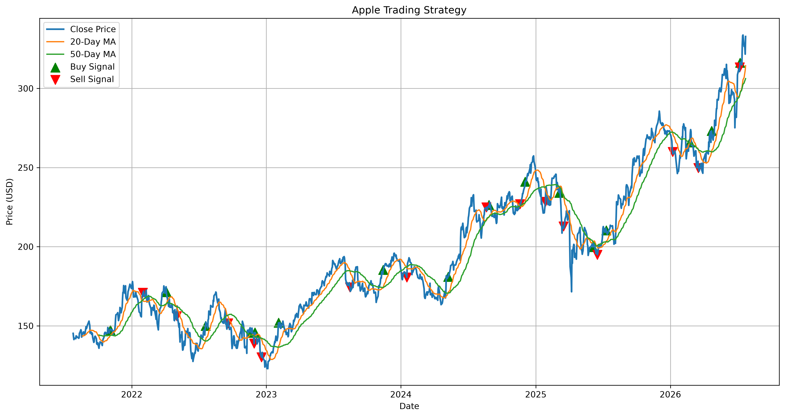
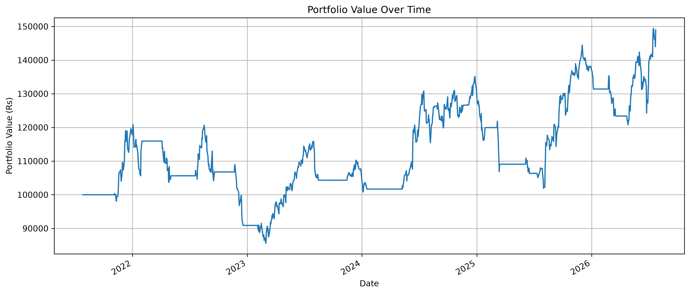
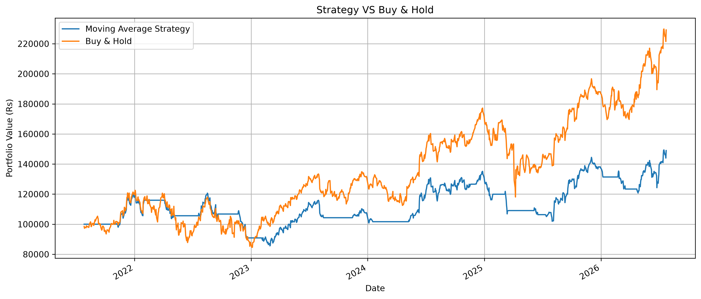
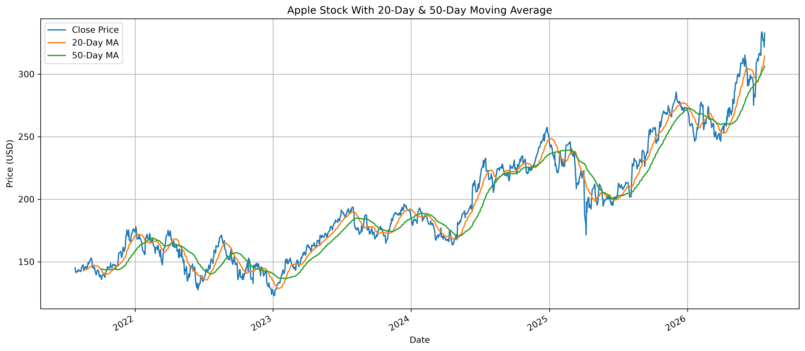
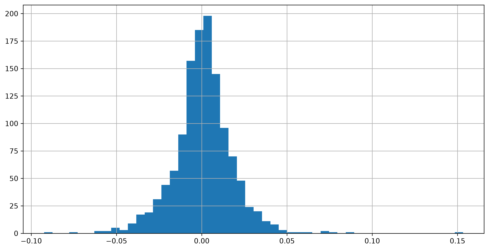

# 📈 Stock Market Analysis & Moving Average Backtesting Strategy

## Overview

This project is a Python-based stock market analysis and backtesting system developed using Apple (AAPL) historical stock data.

The project analyzes stock prices, calculates technical indicators, generates trading signals based on Moving Average Crossovers, backtests the strategy, and evaluates its performance using professional financial metrics.

This project was built as part of my Data Science and Quantitative Finance learning journey.

---

## Features

* Historical stock price analysis
* Daily return calculation
* 20-Day Moving Average
* 50-Day Moving Average
* Buy and Sell signal generation
* Trading strategy backtesting
* Portfolio value simulation
* Market vs Strategy comparison
* Maximum Drawdown calculation
* Sharpe Ratio calculation
* Professional performance report

---

## Technologies Used

* Python
* Pandas
* NumPy
* Matplotlib
* yFinance
* Jupyter Notebook

---

## Strategy

The trading strategy is based on a Moving Average Crossover.

* Buy when MA20 crosses above MA50
* Sell when MA20 crosses below MA50

The strategy is then compared against a Buy & Hold investment.

---

## Results

| Metric            |       Value |
| ----------------- | ----------: |
| Initial Capital   |    ₹100,000 |
| Final Portfolio   | ₹143,653.11 |
| Strategy Return   |      43.65% |
| Buy & Hold Return |     121.62% |
| Sharpe Ratio      |        0.49 |
| Maximum Drawdown  |     -29.09% |
| Completed Trades  |          15 |

## Visualizations

## Screenshots

### Trading Strategy

<p align="center">

</p>
---

### Portfolio Value

<p align="center">

</p>
---

### Strategy vs Buy & Hold

<p align="center">

</p>
---

### Moving Averages

<p align="center">

</p>
---

### Daily Return Distribution

<p align="center">

</p>
---

## Future Improvements

* RSI Strategy
* MACD Strategy
* Multiple Stock Backtesting
* Trade Log Generation
* Win Rate Calculation
* Profit Factor
* Interactive Dashboard using Streamlit

---
## Project Structure

```text
Stock-Market-Analysis
│
├── notebooks
│   └── moving_average_backtesting.ipynb
│
├── outputs
│   ├── charts
│   └── reports
│
├── requirements.txt
└── README.md
```

---
## Installation

Clone the repository

```bash
git clone https://github.com/lokeshrai1/Stock-Market-Analysis.git

### Install dependencies

```bash
pip install -r requirements.txt
```

### Open the notebook

```text
notebooks/moving_average_backtesting.ipynb
```

---

## Author

**Lokesh Rai**

B.Tech Computer Science Engineering

Aspiring Data Scientist | Quantitative Finance Enthusiast

Currently learning:

- Python
- Data Science
- Machine Learning
- Quantitative Finance
